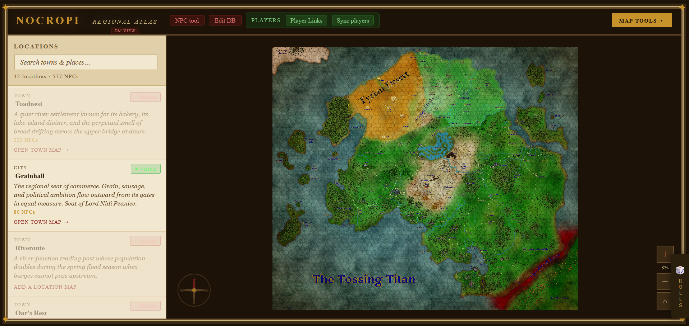
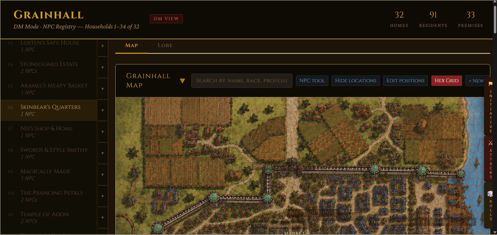
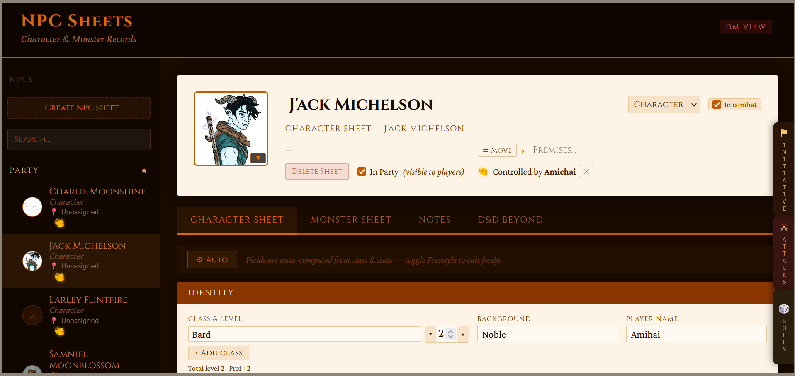
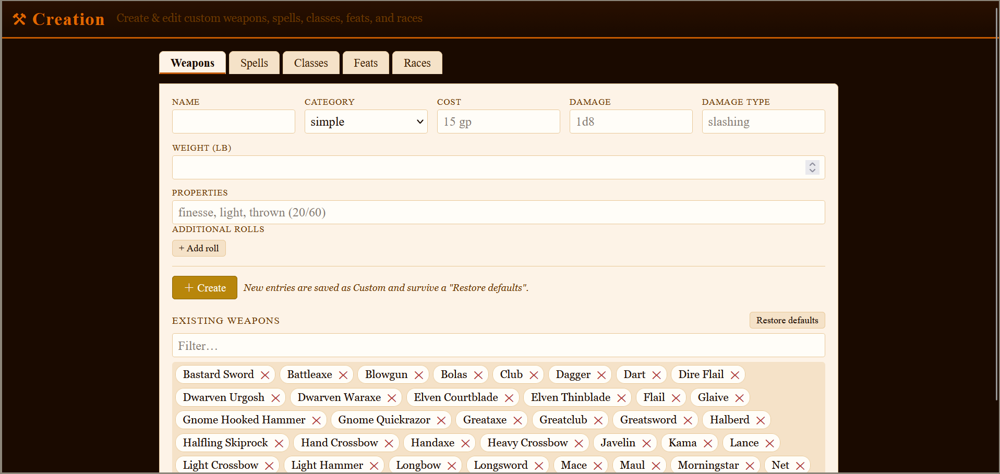

# D&D Campaign Tools

[](https://github.com/TomMeyran/dnd-campaign-tools/actions/workflows/ci.yml)


A self-hosted toolkit for running a tabletop (D&D 5e) campaign as the Dungeon
Master: an interactive **map / atlas**, a full **NPC & monster manager**, a
**character-creation sheet**, and a shared **dice roller** — one Node server,
live-synced across every open browser tab over Server-Sent Events.

This repository is a **self-contained demo**. It ships with two pre-built towns
(Millhaven and Thorngate) and 20 example NPCs, so it runs out of the box with no
configuration and no real campaign data.

> **Live demo:** `npm install && npm start`, then open <http://localhost:3000>.

## Screenshots

**Regional atlas** — searchable locations, per-town visibility, and a zoomable world map.



**Town map** — hex grid, household registry, and docked initiative/attacks panels for combat.



| NPC & monster tool | Character / content creation |
| :---: | :---: |
|  |  |

## Features

- **Map / atlas tool** — pan-and-zoom world and town maps with a hex grid,
  per-location detail views, and DM-controlled visibility (reveal houses, NPCs,
  and notes to players independently).
- **NPC & monster tool** — full 5e character sheets and stat blocks, portrait
  uploads, DM notes, and a per-note "send to players" toggle that surfaces the
  note in the players' map view.
- **Character creation** — guided ability scores, saves, skills, combat stats,
  spellcasting, and backstory, driven by bundled rules data (backgrounds,
  equipment, spell scaling).
- **Shared dice roller** — d20 checks with advantage/disadvantage and damage
  expressions (`2d6+3`), usable from any tool, with a live cross-tool roll log.
- **Live sync** — the tools talk to each other over Server-Sent Events, so a
  change in one view updates the others without a refresh.

## Tech stack

- **Node.js + Express** — single unified server (`server.js`), ~60 JSON/HTML routes.
- **sql.js** — SQLite compiled to WebAssembly, so the database needs **no native
  build step** and the repo installs cleanly on any OS.
- **Vanilla JavaScript / HTML / CSS** — no front-end framework; each tool is a
  self-contained page.
- **Server-Sent Events** — cross-tool live updates, with a polling fallback for
  buffered connections.
- **Zero runtime dependencies beyond Express + sql.js.**

## Architecture

```
┌────────────┐   SSE (live)   ┌──────────────┐
│  Map tool  │◄──────────────►│              │
├────────────┤                │  server.js   │  Express + sql.js
│  NPC tool  │◄──────────────►│  (~60 routes)│──► map_data.db (SQLite/WASM)
├────────────┤   fetch / POST │              │
│ Dice roller│◄──────────────►│              │
└────────────┘                └──────────────┘
```

- One server serves all three tools and mediates every cross-tool message.
- The map tool is mounted at the web root so player-facing URLs stay short
  (`/nocropi.html?key=…`).
- Game state (towns, NPCs, notes, combat) lives in a single SQLite file that is
  restored on startup and written through as the DM makes changes.

## Running the demo

Requires **Node.js 18+**.

```bash
npm install        # first time only
npm start          # or: node server.js  /  double-click start.bat on Windows
```

Then open:

- DM map / atlas — <http://localhost:3000>
- DM NPC tool — <http://localhost:3000/npcs/npc_tool.html>

To change the port, set the `PORT` environment variable before starting.
To reset the demo data at any time, run `node create_demo_db.js`.

See [HOW_TO_RUN.txt](HOW_TO_RUN.txt) for more detail.

## Tests

```bash
npm test           # node --test — boots the server and checks the core routes
```

The suite spawns the real server on a throwaway port and asserts that the pages,
scripts, JSON APIs, and the seeded demo database all respond correctly. It uses
only Node's built-in test runner — no extra dependencies. CI runs it on Node 18,
20, and 22 via GitHub Actions.

## Optional: exposing the demo to remote players

Out of the box the server is **local only** — no tunnel is required and none is
bundled. If you want players to reach it over the internet, run any HTTP
tunnel that points at `http://localhost:3000`; the app is tunnel-agnostic and
serves player links from whatever public URL you give it. Options:

| Tool | Command | Account needed |
| --- | --- | --- |
| Cloudflare Tunnel | `cloudflared tunnel --url http://localhost:3000` | No (random `*.trycloudflare.com` URL) |
| ngrok | `ngrok http 3000` | Yes (free tier + authtoken) |
| localtunnel | `npx localtunnel --port 3000` | No |

The tunnel binary itself is **not** included in this repo — download it from its
own project. The server treats the DM as anyone connecting from `localhost` and
everyone arriving through the tunnel as a player. Optionally, tell the app its
public URL so player links use it instead of `localhost`:

```bash
curl -X POST http://localhost:3000/api/tunnel-url \
  -H "Content-Type: application/json" \
  -d "{\"url\": \"https://<your-public-url>\"}"
```

## Notes

- The demo runs locally only; there is no player-facing remote tunnel in this
  build.
- No secrets are bundled. The cookie-signing secret is generated automatically
  on first run and kept in a local, git-ignored file. Optional Discord/DM
  features stay disabled unless you provide the relevant `CAMPAIGN_*` environment
  variables.

## License

[MIT](LICENSE)
